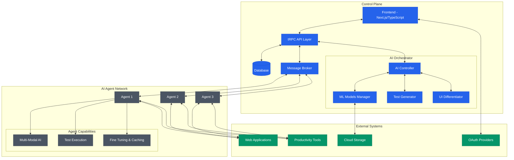

```mermaid
graph TB
    subgraph "Control Plane"
        FE[Frontend - Next.js/TypeScript]
        API[tRPC API Layer]
        DB[(Database)]
        MB[Message Broker]
        
        subgraph "AI Orchestrator"
            AIC[AI Controller]
            MLM[ML Models Manager]
            TG[Test Generator]
            DIFF[UI Differentiator]
        end
    end

    subgraph "AI Agent Network"
        A1[Agent 1]
        A2[Agent 2]
        A3[Agent 3]
        
        subgraph "Agent Capabilities"
            MM[Multi-Modal AI]
            TE[Test Execution]
            FTC[Fine Tuning & Caching]
        end
    end

    subgraph "External Systems"
        AUTH[OAuth Providers]
        WEB[Web Applications]
        STORAGE[Cloud Storage]
        TOOLS[Productivity Tools]
    end

    %% Control Plane Connections
    FE <--> API
    API <--> DB
    API <--> MB
    API <--> AIC
    AIC <--> MLM
    AIC <--> TG
    AIC <--> DIFF
    
    %% AI Agent Connections
    MB <--> A1
    MB <--> A2
    MB <--> A3
    
    A1 --> MM
    A1 --> TE
    A1 --> FTC
    
    %% External Connections
    FE <--> AUTH
    A1 <--> WEB
    A2 <--> WEB
    A3 <--> WEB
    MLM <--> STORAGE
    A1 <--> TOOLS
    A2 <--> TOOLS
    A3 <--> TOOLS

    classDef primary fill:#2563eb,stroke:#1d4ed8,color:white
    classDef secondary fill:#4b5563,stroke:#374151,color:white
    classDef external fill:#059669,stroke:#047857,color:white

    class FE,API,DB,MB,AIC,MLM,TG,DIFF primary
    class A1,A2,A3,MM,TE,FTC secondary
    class AUTH,WEB,STORAGE,TOOLS external
```