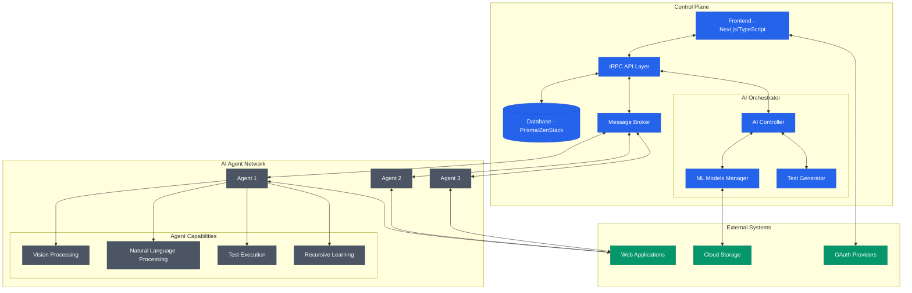

The Iris architecture is an elegant and intelligent system designed for autonomous web testing.

The code is available at [github.com/tryiris/iris](https://github.com/codebanesr/irisland).

## Architecture Components

### Control Plane

The Control Plane is the central nervous system of Iris, built with modern technologies:

<Card title="T3 Stack Integration" icon="layer-group">
  * Built on the [T3 Stack](https://create.t3.gg/) with ZenStack for type-safe database operations
  * Manages the message broker for efficient test distribution
  * Orchestrates the multimodal AI agents
</Card>

<Card title="Frontend Interface" icon="browser">
  * Built with [Next.js and TypeScript](https://app.tryiris.dev)
  * Provides an intuitive interface for test creation and monitoring
  * Connects via tRPC for type-safe API communications
</Card>

<Card title="Data & Security" icon="shield-check">
  * Authentication through secure OAuth providers
  * [Prisma with ZenStack](https://zenstack.dev/) for robust database management
  * Enhanced access control and data security
</Card>

### AI Agent Network

Our [AI Agents](https://app.tryiris.dev) form a sophisticated distributed network that connects to the control plane through a message broker system. Each agent is equipped with advanced capabilities:

<CardGroup>
  <Card title="Natural Language Processing" icon="language">
    Process and understand test specifications written in plain English
  </Card>
  <Card title="Multimodal Testing" icon="eye">
    Execute tests using combined vision, text, and interaction capabilities
  </Card>
  <Card title="Adaptive Learning" icon="brain">
    Automatically adjust to website changes through recursive learning
  </Card>
  <Card title="Real-time Updates" icon="bolt">
    Update test results instantly to the central database
  </Card>
</CardGroup>

### Network Capabilities

The distributed agent network provides:

* **Dynamic Scaling**: Automatically scales based on testing demand
* **Self-Organization**: Agents self-organize to handle different test types
* **Collective Learning**: Learn from shared testing experiences
* **Autonomous Adaptation**: Adapt to new testing patterns without manual intervention

### AI Models

The agents leverage state-of-the-art AI models for:

<CardGroup>
  <Card title="Visual Understanding" icon="eye">
    Advanced processing of web interfaces and UI elements
  </Card>
  <Card title="Language Processing" icon="message">
    Natural language understanding of test requirements
  </Card>
  <Card title="Behavior Modeling" icon="user">
    Accurate simulation of human interactions
  </Card>
  <Card title="Test Generation" icon="code">
    Automated creation and execution of test cases
  </Card>
</CardGroup> 